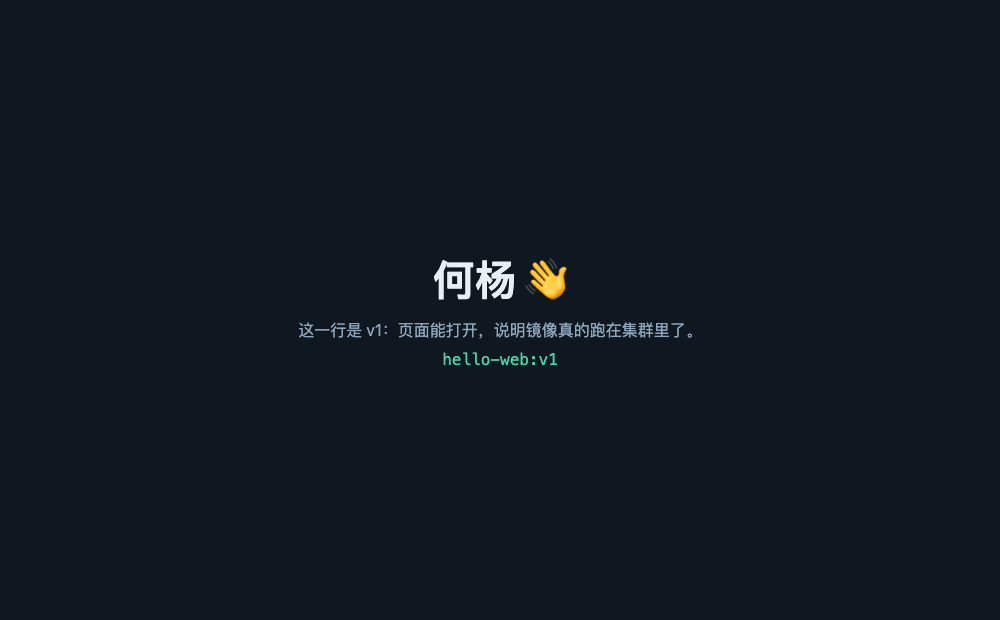
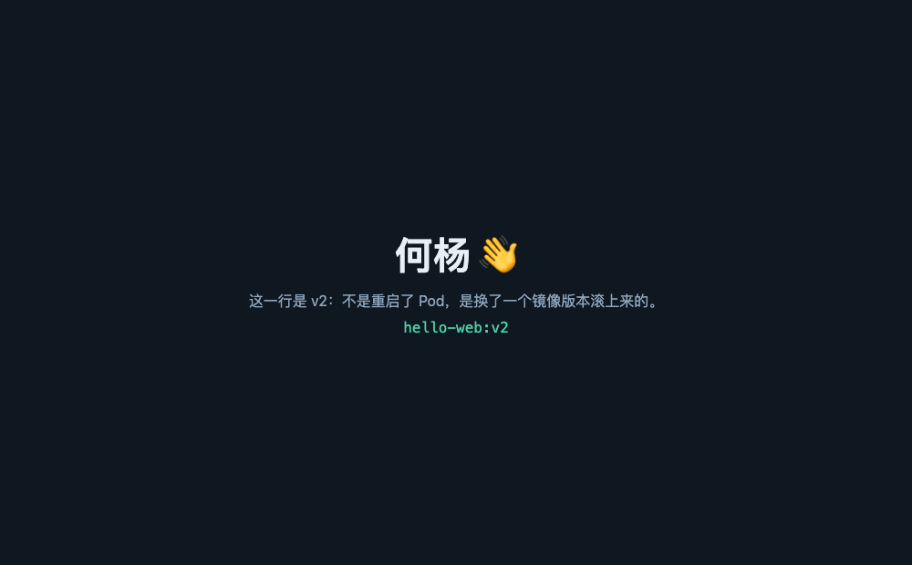

# 第八课 · 发布证据单 · hello-web

发布不是「我点过了」，是别人能复核的四处证据。本次发布全程手动走了一遍流水线的第 2–5 步
（切版本号 → build → login+push → set image + 等 rollout），没有 Runner。

| | |
|---|---|
| 应用 | `hello-web` |
| 命名空间 | `st-heyang` |
| 域名 | <http://heyang.dev.oaiai.ai> |
| 发布的版本 | `v1` → `v2` |

---

## 1 · 来源（commit + 版本号）

| 版本 | 页面内容 | commit | tag |
|---|---|---|---|
| v1 | v1：页面能打开，说明镜像真的跑在集群里了 | `fafe3d6` | `hello-web-v1` |
| v2 | v2：不是重启了 Pod，是换了一个镜像版本滚上来的 | `13e153b` | `hello-web-v2` |

仓库：<https://github.com/HY624/hello> · 目录 `lesson08/`

tag 只打了 `hello-web-v1` / `hello-web-v2` 两个 —— 版本号往前走，不复用。

## 2 · 产物（镜像地址 + tag + digest）

```
registry.dev.oaiai.ai/heyang/hello-web:v1
  digest sha256:686395d4e9ff606fed0ce82dd5530dc5e89838524056afd32ac8d34f91c35d66

registry.dev.oaiai.ai/heyang/hello-web:v2
  digest sha256:42be3b896a5e0236f5c1749c1c59fcaea0a19117a34c1c2d10d3146c88943add
```

> digest 才是这个镜像真正的身份，tag 只是个会移动的指针。
> 本仓库**没有**推 `:latest` —— 部署只认版本号。（平台那条流水线两个都推，是因为它还要给人手动 pull 用；我们不需要。）

构建命令（`--platform` 不能省：集群是 amd64，开发机是 arm64）：

```bash
docker build --platform linux/amd64 --provenance=false --sbom=false \
  -t registry.dev.oaiai.ai/heyang/hello-web:v2 .
docker push registry.dev.oaiai.ai/heyang/hello-web:v2
```

## 3 · 集群状态

```
$ kubectl -n st-heyang get deploy hello-web
NAME        READY   UP-TO-DATE   AVAILABLE
hello-web   2/2     2            2

$ kubectl -n st-heyang get deploy hello-web \
    -o jsonpath='{.spec.template.spec.containers[0].image}'
registry.dev.oaiai.ai/heyang/hello-web:v2

$ kubectl -n st-heyang get pods -l app=hello-web
NAME                         READY   STATUS    RESTARTS
hello-web-7c55f54c74-blthx   1/1     Running   0
hello-web-7c55f54c74-dr7w7   1/1     Running   0
```

`READY 1/1` 是 readinessProbe 过的结果 —— 探针过了这个 Pod 才被加进 Service。滚动更新的
过程（`kubectl get pods -w` 实录，节选）：

```
hello-web-7c55f54c74-blthx   0/1   Pending            0   0s   ← 新 Pod 先建
hello-web-7c55f54c74-blthx   0/1   ContainerCreating  0   1s
hello-web-7c55f54c74-blthx   1/1   Running            0   6s   ← 新 Pod 就绪
hello-web-65d9c97c89-6tdrh   1/1   Terminating        0  76s   ← 旧 Pod 才开始拆
hello-web-7c55f54c74-dr7w7   1/1   Running            0   7s
hello-web-65d9c97c89-9dn8d   1/1   Terminating        0  83s
```

**先建后拆**，全程至少 2 个 Pod 在服务 —— 这就是滚动更新期间域名不断的原因。

## 4 · 用户路径

`v1.png` / `v2.png`（同目录），两张都是 `http://heyang.dev.oaiai.ai` 的真实渲染：

| v1 | v2 |
|---|---|
|  |  |

页面上的那行字从「这一行是 v1…」变成「这一行是 v2…」，就是这次发布最直接的证据。

---

## 附 · 如果 v2 上错了，怎么退回去？

**不删 Pod、不改 `:latest`、不复用失败的那个 tag**，回到一个已知的稳定版本：

```bash
# 1. 先看历史，确认要退回哪一版
kubectl -n st-heyang rollout history deploy/hello-web
kubectl -n st-heyang rollout history deploy/hello-web --revision=1    # 看 revision 1 用的镜像

# 2a. 退回上一版
kubectl -n st-heyang rollout undo deploy/hello-web

# 2b. 或者明确点回到 v1 这个版本号（本次的实际做法）
kubectl -n st-heyang set image deploy/hello-web \
  web=registry.dev.oaiai.ai/heyang/hello-web:v1

# 3. 等它滚完，并记下回滚原因
kubectl -n st-heyang rollout status deploy/hello-web --timeout=120s
```

三点理由：

- **删 Pod 不是回滚**：Deployment 会立刻按同一个坏镜像重建一个，问题照旧，还把现场毁了。
- **不要用 `:latest`**：它是个漂移标签，回到的未必是你要的那一版，故障也就无法复现。
- **失败的 tag 不能复用**：tag 一旦推过就等于发过，仓库里那个版本已经存在，别人拉到的可能还是旧的失败版本。要修就发 `v3`，让历史保持干净。

> 补充：本次 Deployment 的 `CHANGE-CAUSE` 是 `<none>`（没用 `--record`，那个参数在新版 kubectl 里也已经废弃）。
> 要留下「为什么改」的记录，可以发布时打注解：
> `kubectl -n st-heyang annotate deploy/hello-web kubernetes.io/change-cause="v2: 改首页那行字"`

---

## 收尾

课件要求命名空间共用，实验做完可以清理（域名会随之失效，需要时再 apply 一次即可）：

```bash
kubectl -n st-heyang delete -f lesson08/hello-web.yaml
# regcred 留着，换版本还要用
```
